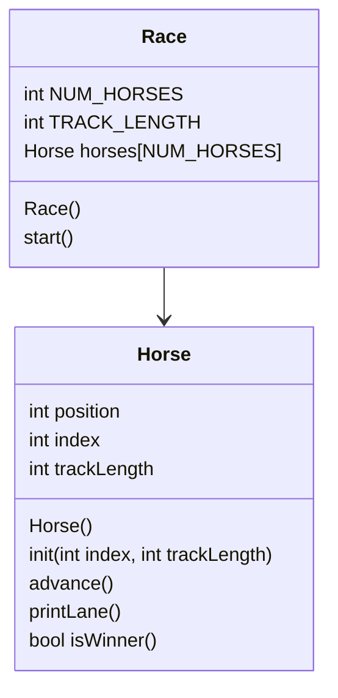

# OOP horse race

## UML



## Horse::Horse()
```
set position to 0
set index to 0
set track length to 15
```

## void Horse::init(int index, int trackLength)
```
set position to 0
set Horse::index to index
set Horse::trackLength to trackLength
```

## void Horse::advance()
```
assume random generator is seeded
roll a random between 0-1, store in int coin
add coin to position, put result back in position
```

## void Horse::printLane()
```
make for loop, position goes from 0 to trackLength
  if position == Horse::position:
    print Horse::index
  otherwise:
    print '.'
after loop, print a newline
```

## bool Horse::isWinner()
```
bool result = false
if position >= trackLength:
  result = true
  print horse number won
return result
```

## Race::Race()
```
  const static int NUM_HORSES = 5
  const int TRACK_LENGTH = 15

  seed random generator c way

  initialize the horses array
  for each horse:
    initialize with index and trackLength
```

## void Race::start()
```
bool keepGoing = true
while keepGoing:
  for each horse:
    advance that horse
    print its lane
    if it is the winner:
      set keepGoing to false
```
